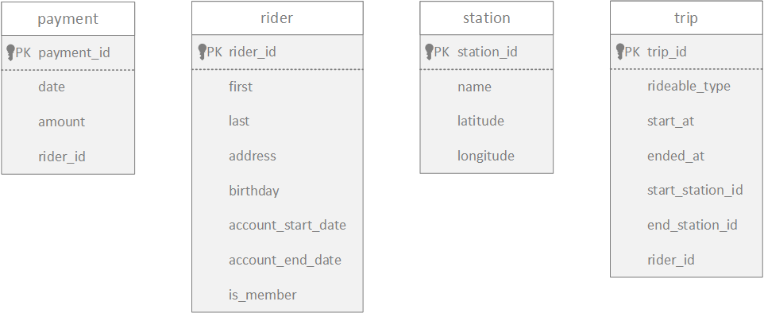
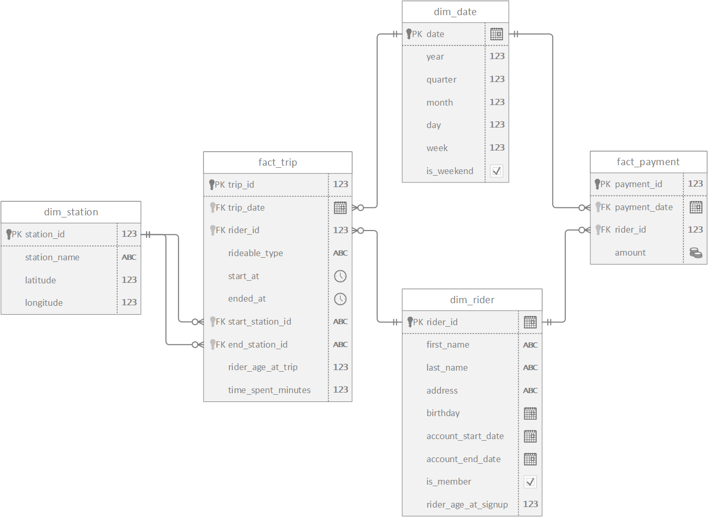

# Building an Azure Data Warehouse for Bike Share Data Analytics

Divvy is a bike sharing program in Chicago, Illinois USA that allows riders to purchase a pass at a kiosk or use a mobile application to unlock a bike at stations around the city and use the bike for a specified amount of time. The bikes can be returned to the same station or to another station. The City of Chicago makes the anonymized bike trip data publicly available for projects like this where we can analyze the data. The dataset looks like this:

The goal of this project is to develop a data warehouse solution using Azure Synapse Analytics. We will:
- Design a star schema based on the business outcomes listed below;
- Import the data into Synapse;
- Transform the data into the star schema;
- and finally, analyze and visualize data with Power BI.

The business outcomes we are designing for are as follows:

- Analyze how much time is spent per ride
  - Based on date and time factors such as day of week and time of day
  - Based on which station is the starting and / or ending station
  - Based on age of the rider at time of the ride
  - Based on whether the rider is a member or a casual rider
- Analyze how much money is spent
  - Per month, quarter, year
  - Per member, based on the age of the rider at account start

Based on the provided business requirements for the data warehouse, we will create the following star schema using fact and dimension tables.

With this project, we will create an end-to-end Azure data warehousing solution, with the architecture as follows:

> Please refer to [Project Implementation Report](<./Project Implementation Report.pdf>) for detailed steps.

> Click [here](https://video.udacity-data.com/topher/2022/March/622a5fc6_azure-data-warehouse-projectdatafiles/azure-data-warehouse-projectdatafiles.zip) to download the dataset used in the project.
